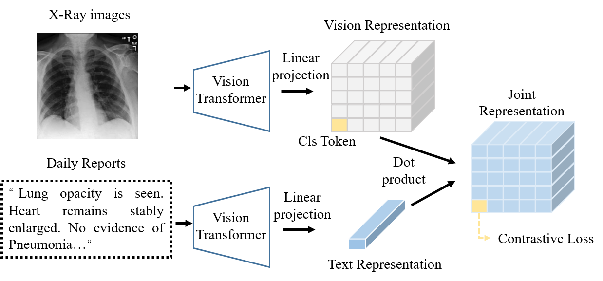

# MGA
The code of the submited paper 'Medical generalist agent through language-guided knowledge transformation' (MGA)

The base architecture. MGA adapts CLIP as baseline and innovatively control the representation of the output by text-guided knowledge transformation

# Abstract:
Multi-modal representation methods have achieved advanced performance in medical applications by extracting more robust features from multi-domain data. However, existing methods usually need to train additional branches for downstream tasks, which may increase the complexities in clinical applications and may also increase human inductive bias via single task training. Moreover, few studies consider clinical knowledge from clinical daily-reports. To this aim, we propose a novel medical generalist agent, MGA, that can address three kind of common clinical tasks via clinical reports knowledge transformation. Unlike the common AI model, MGA does not need any task-based branches. More importantly, we are the first to propose that text-guidance can serve as a transmission medium to guide the agent behavior. The proposed method is evaluated on four well-known X-ray open-source dataset MIMIC-CXR, CheXpert, MIMIC-CXR-JPG and MIMIC-CXR-MS, showing the promising results of the medical universal agents.

# Vision:
The complete code will be uploaded once the article is accepted.
